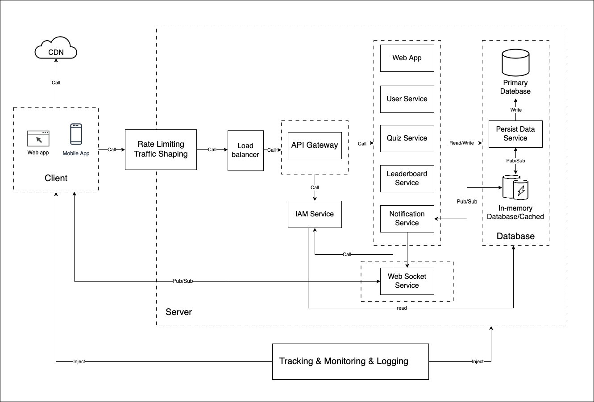
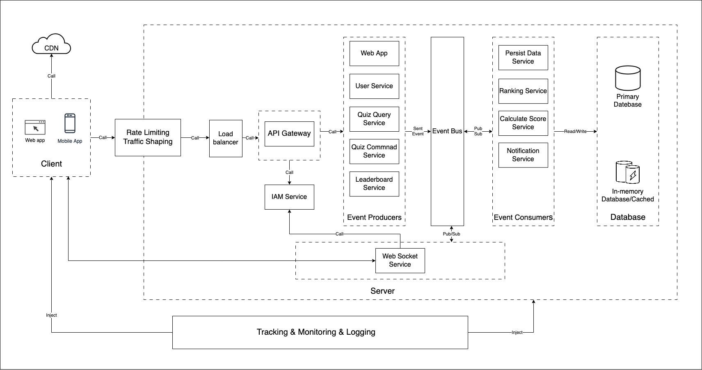

### Please read the [Requirements Analysis](requirements-analysis.md) before continue reading
### Assume that we are designing for an on-premises system, not the cloud.
# Architecture Diagram

# Component Description
### 1. CDN (Content Delivery Network)
**Purpose**: Improve load times and reduce the latency of the client application.
**Roles**:
  - Cache and distribute static content (such as images, JavaScript, CSS files, etc.) to users based on their geographic location.

### 2. Client (Mobile App)
**Roles**:
  - Send quiz answers and receive updates from backend services.
  - Display real-time data, such as quiz progress, questions, leaderboard updates.

### 3. Rate Limiting and Traffic Shaping
**Roles**:
  - Control the flow and distribution of traffic.
  - Mitigates DoS (Denial-of-Service) attacks.

### 4. Load Balancer
**Purpose**: Ensures the availability of API Gateway.
**Roles**:
  - Distribute incoming traffic across multiple API Gateway instances.

### 5. API Gateway
**Purpose**: Ensures client can request to the appropriate backend services.
**Roles**:
  - Route client requests to the appropriate backend services.
  - Handle request authentication and authorization.

### 6. IAM Service (Identity and Access Management)
**Roles**:
  - Manage user identities, roles, and permissions.
  - Implement authentication protocols.

### 7. Web App
**Purpose**: Return to the browser in a web app.
**Roles**:
- Save build of frontend application.

### 8. User Service
**Purpose**: Separate of Concern and run in container that can be scale both vertical and horizontal.
**Roles**:
  - Create, store, and manage user profiles.

### 9. Quiz Service
**Purpose**: Separate of Concern and run in container that can be scale both vertical and horizontal.
**Roles**:
  - Handle join quiz session requests from users.
  - Receiving answers, validate answers, calculate scores.

### 10. Leaderboard Service
**Purpose**: Separate of Concern and run in container that can be scale both vertical and horizontal.
**Roles**:
  - Handle get/update leaderboard request.

### 11. Notification Service
**Purpose**: Separate of Concern and run in container that can be scale both vertical and horizontal.
**Roles**:
  - Listen for changes in data in in-memory database.
  - Sent real-time notifications request to websocket service.

### 12. Web Socket Service
**Purpose**: Use web socket to communicate with client
**Roles**:
  - Manage WebSocket connections, validating and maintaining active connections with clients.
  - Push real-time updates (e.g., quiz question changes, leaderboard updates) to clients as they occur.

### 13. Primary Database
**Purpose**: Ensure data consistency and durability, supporting transactional operations as needed. 
**Roles**:
  - Store and manage all core data related to users, quizzes, questions, answers, and scores.

### 14. In-Memory Database
**Purpose**: Improves performance by reducing the load on the primary database and storing temporary or frequently accessed data.
**Roles**:
  - Cache frequently requested data (e.g., leaderboard data, session information).
  - Store temporary data such as real-time quiz session data and user progress.
  - Implement a Pub/Sub model to notify relevant services of updates.

### 15. Persist Data Service
**Purpose**: Persist Particular Data
**Roles**:
   - Pub/Sub In-memory Database to Persist Particular Data

### 16. Tracking, Monitoring & Logging
**Purpose**: Analytics and notice about user and system
**Roles**:
  - **Tracking**: Track and analyze realtime error, user behavior, collecting data for insights and improvements.
  - **Monitoring**: Continuously monitor the health and performance of server.
  - **Logging**: Collect logs for debugging, troubleshooting, and auditing backend services to maintain system reliability.

# Data flow
All request be process by Rate Limiting and Traffic Shaping, Load balancer, API Gateway and IAM service.
1. User Participation:
   1. **Client** request **Quiz Service** to join a quiz session
   2. **Quiz Service** save join data to **Primary Database**
   3. **Quiz Service** read quiz session data from **In-memory Database**, if can't, then read from **Primary Database** the save to **In-memory Database**
   4. **Quiz Service** response quiz session data to **Client**
2. Real-Time Score Updates:
   1. **Client** post the answer for a question to **Quiz Service**
   2. **Quiz Service** get data from **In-memory Database** and validate answer
   3. **Quiz Service** consume score for User and save it to **In-memory Database**
   4. **Quiz Service** response result include new score to **Client** 
   5. **Persist Data Service** get data form **In-memory Database** to save to **Primary Database**
3. Real-Time Leaderboard:
   1. **Client** connect with **Web Socket Service**
   2. **Client** request **Leaderboard Service** to watch the leaderboard with user config
   3. Leaderboard Service save user config to **In-memory Database**
   4. **In-memory Database** call **Notification Service** for new score update
   5. **Notification Service** write user config for leaderboard and new leaderboard
   6. **Notification Service** sent request to **Web Socket Service** with new leaderboard data
   7. **Web Socket Service** sent new leaderboard data to **Client**

# Technology Justification:
Technology is chosen based on the 2 metrics: 
- **Ability to meet the needs** 
- **Compatibility of the technology with the legacy system and people**

**In this challenge, I ignore other features and the compatibility of the technology with the legacy system**

This feature is small and don't have any heavy process or special things.
I will choose the following stack which I am familiar with:
1. CDN: **Cloudflare**. It fit with this requirement.
2. Load balancer: **Nginx**. It fit with this requirement.
3. Rate Limiting and Traffic Shaping: **Cloudflare**. It fit with this requirement.
4. API Gateway: **Kong**. It fit with this requirement. 
5. Front-end and Back-end: **React(CSR)/React Native/NestJs** with **TypeScript** in a **Monorepo**.
   The core business use the same code => more consistency and reused code
   Team can implement both web app, mobile app, back-end while it use the same language, library 
   CSR does not consume significant resources as it is super lightweight after the build.
6. Primary Database: **MongoDB**. Use No-Relationship DB for this kind of simple data and suitable for real-time data processing.
7. In-memory Database: **Redis**. It fit with this requirement.
8. Web Socket: This feature we can also use SSE (Server-sent event).
I choose Web Socket because it is sorter latency.
It means I prioritize the "real-time" keyword.
The limit is it more duplicate for implement, maintain and scale.
9. Tracking, Monitoring, and Logging: **Sentry** for client, **Prometheus** and **Grafana** for server.

# For the future
### When the system need handle a massive request, we can upgrade the system to event-driven architecture by the following diagram

